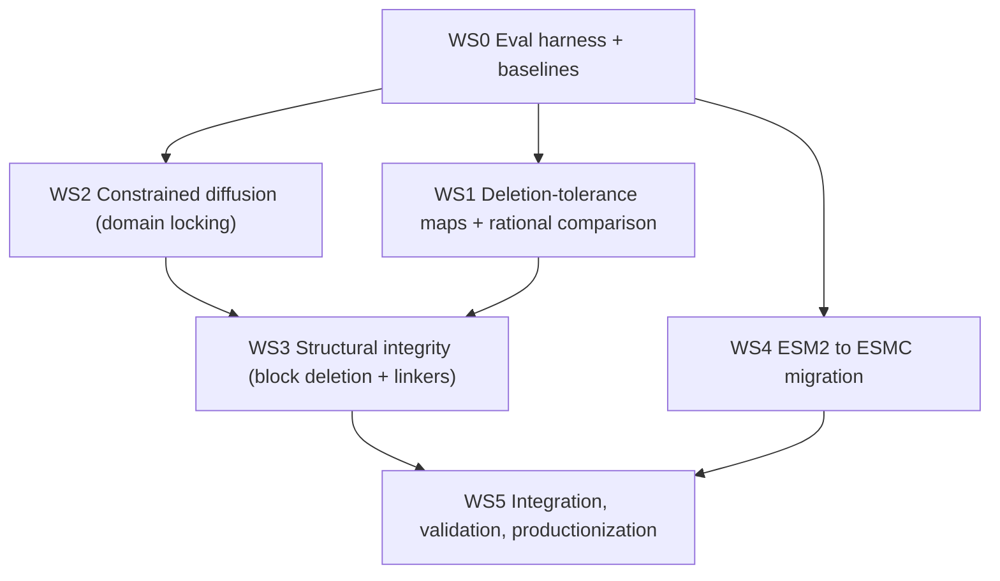

# SCISOR Protein Minimization — Roadmap

A multi-month program to evolve SCISOR from a naturalness-only residue-deletion model
into a **constrained, structure-aware protein-minimization platform** for real-world
therapeutic targets, validated against rational/manual designs.

This document is the top-level plan. Detailed design briefs:

- [evaluation.md](evaluation.md) — scoring stack and the comparison against rational designs
- [constrained-diffusion.md](constrained-diffusion.md) — domain locking via keep-masks
- [structural-integrity-linkers.md](structural-integrity-linkers.md) — block deletion + linker repair
- [esmc-migration.md](esmc-migration.md) — swapping the ESM2 backbone for ESMC

---

## 1. Problem and vision

Many therapeutic proteins are too long to deliver by AAV. The single-stranded AAV
genome holds ~4.7 kb; after regulatory overhead (ITRs, promoter, polyA; budgeted here
at ≤875 bp) the coding sequence budget is:

```
CDS budget = 4700 - 875 = 3825 bp
(N residues + 1 stop) * 3 <= 3825  =>  N <= 1274 aa
```

So our hard size ceiling is **1,274 aa**. The goal is to shrink long targets to within
this ceiling **while preserving fold and function** — not just naturalness.

SCISOR gives us a learned prior over *which residues can be deleted* while keeping a
sequence natural. By itself that is necessary but not sufficient: naturalness does not
guarantee that catalytic residues survive, that domain orientation is preserved, or
that the tertiary structure stays organized. This program adds those guarantees.

Operating posture: **auditable**. Every construct should be traceable to a
deletion map, a constraint set, and a scored fold, with reproducible scripts.

### Initial targets
| Target | UniProt | Length | → 1274 aa | deletions |
|---|---|---|---|---|
| SYNGAP1 | Q96PV0 | 1343 | 1274 | 69 (5.1%) |
| SHANK3 | Q9BYB0 | 1806 | 1274 | 532 (29.5%) |
| TSC2 | P49815 | 1807 | 1274 | 533 (29.5%) |

Calibration anchor: full-length dystrophin (P11532, 3685 aa) shrunk toward
micro-dystrophin size — a clinically validated minimization to check SCISOR against.

---

## 2. Current state (done)

- SCISOR runs for inference on a Tesla T4 (no FlashAttention): backbone built with
  `use_fa=False` → HuggingFace pure-PyTorch RotaryEmbedding + Torch SDPA. Pinned
  `transformers==4.46.3`; fresh ESM2 tokenizer to avoid the stale pickled one.
- Fork live at `davidlevybooth-dyno/SCISOR` with the inference patch and runner.
- [scisor_shrink.py](../scisor_shrink.py): no silent length filter, local checkpoints,
  `--target-length` (AAV budget) and `--num-samples` (stochastic) modes.
- Confirmed SCISOR is stochastic at `temperature=1` (multinomial deletions).
- Baseline samples: 32 stochastic shrinks/target at 1,274 aa (U90_S) for
  TSC2 / SHANK3 / SYNGAP1.

## 3. Scope of this program (not yet done)

- An evaluation stack (structure / motif / interface / AAV-fit / naturalness).
- A quantitative comparison of SCISOR vs rational deletions.
- Constrained diffusion: hard domain locking (keep-masks).
- Structural integrity: contiguous block deletion + variable-length linker repair
  (the hardest workstream).
- ESM2 → ESMC backbone migration (requires retraining; A100).

---

## 4. Workstreams and dependencies



| WS | Theme | Brief |
|---|---|---|
| WS0 | Evaluation harness + baselines | [evaluation.md](evaluation.md) |
| WS1 | Deletion-tolerance maps + rational-design comparison | [evaluation.md](evaluation.md) |
| WS2 | Constrained diffusion (domain locking) | [constrained-diffusion.md](constrained-diffusion.md) |
| WS3 | Structural integrity (block deletion + linkers) | [structural-integrity-linkers.md](structural-integrity-linkers.md) |
| WS4 | ESM2 → ESMC migration | [esmc-migration.md](esmc-migration.md) |
| WS5 | Integration, validation, productionization | this doc |

---

## 5. Phased timeline (~6 months)

Weeks are indicative and overlap. Each milestone lists a deliverable, a success
criterion, and the compute it needs.

### Phase 1 — Baselines and evaluation (weeks 1–4) · WS0, WS1
- **M1.1 Eval harness v1.** `scisor_score.py` scores a shrunk FASTA on structure
  (ESMFold/Boltz pLDDT, templated RMSD/TM to original domains), motif retention,
  and AAV-fit. *Success:* one command turns the 32-sample baselines into a ranked
  table. *Compute:* T4 (folding small batches) or A100 for throughput.
- **M1.2 Deletion-tolerance maps.** Per-residue deletion frequency across the 32
  samples, plus the M-sweep (delete d% for d in a grid), overlaid on domain maps.
  *Success:* a figure per target showing where SCISOR wants to cut vs keep.
- **M1.3 Rational-design comparison.** Ingest rational designs (MT9, SHANK3/SYNGAP1
  minigenes) as FASTAs; score head-to-head with SCISOR samples; agreement metric
  between SCISOR keep-signal and the rational frozen sets. *Success:* a written
  baseline-vs-rational report; micro-dystrophin calibration sanity check.

### Phase 2 — Constrained diffusion (weeks 5–10) · WS2
- **M2.1 Keep-mask in sampling.** Apply a frozen-position mask in `p_sample`
  (where exclusion masks already live, `shortening_scud.py` lines 127–132).
  *Success:* 0 deletions in frozen sets across N samples; target length still met.
- **M2.2 Constraint schema + runner flag.** Per-target frozen-set spec
  (UniProt features + manual catalytic/ligand motifs); `--keep-mask` in the runner.
  *Success:* reproducible constrained runs for all three targets.
- **M2.3 Constrained baselines.** Re-generate the 32-sample sets with locks on;
  compare naturalness/score cost of constraints vs unconstrained. *Compute:* T4/A100.

### Phase 3 — Structural integrity (weeks 8–16) · WS3 (highest risk)
- **M3.1 Flexibility/deletability map.** Combine SCISOR signal with disorder
  (pLDDT, cryo-EM unresolved, IUPred) to propose **contiguous deletable blocks**
  rather than scattered residues. *Success:* block proposals that match known
  disordered scaffolds on TSC2/SHANK3/SYNGAP1.
- **M3.2 Junction repair with linkers.** Splice retained segments and insert
  variable-length linkers — flexible (GGGGS)n length-matched to the gap, rigid
  (EAAAK)n at orientation-sensitive junctions. *Success:* gap-sized linkers chosen
  from structural geometry, not a fixed spacer.
- **M3.3 Refold validation loop.** Fold each construct; check domain pLDDT, RMSD to
  templates, and inter-domain orientation; iterate linker length/type. *Success:*
  **automatically reproduce an MT9-quality TSC2 minigene** (the validation target).
- *Compute:* A100 strongly preferred (many folds in the loop).

### Phase 4 — ESMC migration (weeks 12–20) · WS4 (parallel to Phase 3)
- **M4.1 Backbone swap.** Replace ESM2/FAESM with ESMC; re-wire FiLM conditioning;
  decide which embedding layer(s) condition the denoiser. *Success:* forward pass
  + a short training run converges.
- **M4.2 Retrain SCISOR-C.** Train the denoiser on ESMC embeddings (UniRef). *Compute:*
  A100 (paper trained S/M ~1 week on 2× A100). *Success:* ProteinGym deletion-effect
  parity with ESM2 SCISOR.
- **M4.3 SCISOR-C on targets.** Re-run baselines + constrained runs with SCISOR-C;
  compare. *Success:* measurable improvement on our targets or a clear no-go.

### Phase 5 — Integration, validation, productionization (weeks 18–24) · WS5
- **M5.1 Unified pipeline.** One config-driven flow: constraints → block deletion →
  linker repair → fold/score → ranked constructs, with auditable logs.
- **M5.2 External validation.** Retrospective on MT9 and micro-dystrophin; document
  where the platform agrees/disagrees with validated designs.
- **M5.3 Wet-lab handoff.** Construct table + deletion maps + scores + sequences in a
  reviewable package; reproducible scripts pinned.

---

## 6. Compute plan

- **T4 (current):** inference, baselines, small folding batches. Cost reality: a
  ~530-deletion target takes ~60 min for 32 samples (SCISOR deletes one residue per
  denoising step → ~530 sequential forwards × 2 batches of 16; ~3.3 s/step with
  windowing). SYNGAP1 (69 deletions) is minutes.
- **A100 (on demand):** the refold loop (WS3), ESMC retraining (WS4), and larger
  SCISOR models (U90_M/L). Migration is a config/runtime change; the inference code
  already runs without FlashAttention and will use it where available on Ampere.

## 7. Risks and decision points

- **Distribution shift.** SCISOR was trained on UniRef crops ≤1024 aa; our targets
  (1343–1807 aa) sit past that and dystrophin (3685) is heavily windowed. Treat
  SCISOR output as a ranking/prior signal and validate by refold. (Re-evaluate after
  WS1.)
- **Naturalness ≠ structure.** The core thesis of WS2/WS3: locks and linkers are
  required because naturalness alone does not preserve function/organization.
- **Linker geometry is the hard part.** Orientation-sensitive junctions (the HEAT↔GAP
  lesson on TSC2) can fail with floppy linkers; the two-tier rule exists to address
  this but needs empirical tuning.
- **ESMC complexity/licensing.** Multi-layer embeddings, new API, retraining cost.
  Decision gate at M4.1 before committing A100 weeks.

## 8. Glossary
- **Keep-mask / domain locking:** forcing deletion probability to zero at protected
  residues during sampling.
- **Block deletion:** removing a contiguous span (a disordered scaffold) rather than
  scattered single residues.
- **Two-tier linker:** flexible (GGGGS)n by default; rigid (EAAAK)n where domain
  orientation matters.
- **AAV-fit:** whether a construct's CDS fits the 3,825 bp budget (≤1,274 aa).
