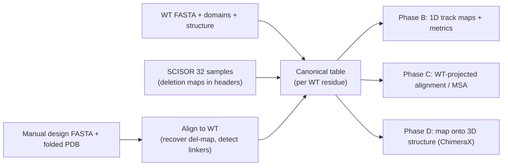

# Assessing minimization: SCISOR vs rational designs (M1.2 / M1.3 detail)

Companion to [evaluation.md](./evaluation.md). That doc defines the scoring axes and the
`scisor_score.py` harness; **this doc is the concrete plan for the comparison/visualization
layer** — how to rapidly see *where SCISOR deletes* relative to your hand-minimized TSC2 /
SHANK3 (and SYNGAP1 once ready), via residue maps, alignment/MSA views, and on-structure
coloring.

The whole thing is designed to be orchestrated from a laptop after pulling the SCISOR
outputs. It needs no GPU; folding (if any) is the only step that benefits from one and is
optional for the core comparison.

---

## 0. Core idea: canonicalize everything to WT residue coordinates

Once each design is expressed as a per-WT-residue decision — **keep / delete**, plus
**insert-linker** for the rational designs — all three views (1D maps, MSA, 3D) are just
different renderings of one table. We already have the hard part for SCISOR.



---

## 1. Input contract (what to pull to the laptop)

On the VM today (note: data is under `protein-shrink/`, the repo is the `SCISOR/` subdir):

| Role | Path (on VM) |
|---|---|
| WT targets | `protein-shrink/targets/{TSC2,SHANK3}.fasta` + `targets/SYNGAP1_alpha1.fasta` |
| SCISOR baselines (32 × 1274 aa) | `protein-shrink/results/aav/{TSC2,SHANK3}_aav1274_n32.fasta` + `SYNGAP1_alpha1_aav1274_n32.fasta` |

> **SYNGAP1 uses the α1 isoform** (`NP_001123538.1`, 1292 aa, C-terminal `-QTRV` PDZ-BM),
> *not* canonical Q96PV0 / `NP_006763.2`. The α1 transcript also lacks two internal cassettes
> the canonical carries (`IDLQSFMARGLNSS` @767–780, `VK` @1195–96). Treat the C-terminal
> α1 exon `RGSFPPWVQQTRV` — especially the `QTRV` PDZ motif — as a **frozen set**: the
> baseline already has 1/32 samples that deleted into it (no keep-mask yet, WS2).
| Manual designs | **you supply** — FASTA + folded PDB |
| WT reference structures | **you supply / fetch** — experimental PDB or AF2/ESMFold model |

Suggested laptop layout:
```
assess/
  targets/TSC2.fasta                      # WT
  scisor/TSC2_aav1274_n32.fasta           # 32 SCISOR samples
  manual/TSC2_MT9.fasta                   # rational design seq
  manual/TSC2_MT9.pdb                     # its fold
  struct/TSC2_wt.pdb                      # WT reference structure (exp or AF2)
  domains/TSC2.json                       # frozen sets / domain spans (WT coords)
```

### SCISOR header format (already in WT coords — just parse)
```
>sp|P49815|TSC2_HUMAN ... |sample 0|mode L1274|deletions A1,K2,T4,L10,...
```
Each deletion entry is `<wt_aa><0-based_index>` (so `A1` = WT residue index 1, the 2nd
residue; the initiator `M0` is retained). Validate by reconstruction: `WT with those indices
removed == the sample sequence`. If it matches, the map is trustworthy with zero alignment.

### Manual-design header (rational-design contract, from evaluation.md §2)
```
>TSC2_MT9-H1|kind rational|target TSC2|notes (GGGGS)x3 junctions
M...designed sequence...
```

---

## 2. Phase A — Build the canonical table (the only non-trivial step)

One tidy table per target. Row = WT residue index `i` (0-based, matching headers).

| column | source | meaning |
|---|---|---|
| `wt_aa` | WT FASTA | residue identity |
| `domain` | `domains/<t>.json` (UniProt features / your frozen sets) | annotated domain or `—` |
| `disorder` | metapredict / IUPred2A on WT, **or** `wt_plddt` from WT structure | dispensability prior |
| `scisor_del_freq` | parse 32 headers | fraction of samples deleting `i` (0–1) |
| `scisor_matrix` (opt.) | parse 32 headers | full 32×L boolean (for per-sample views) |
| `manual_deleted` | **align manual→WT** | WT residue `i` absent from the manual design |

**SCISOR side (trivial):** parse the `deletions` field per record → boolean over `0..L-1`;
average across the 32 → `scisor_del_freq`. No alignment needed.

**Manual side (the alignment):** global-align the manual sequence to WT with affine gaps
(Biopython `Bio.Align.PairwiseAligner`, mode `global`; or `parasail`). The alignment
naturally yields three classes:
- WT residue aligned to a matching manual residue → **kept**
- WT residue aligned to a gap → **deleted** (`manual_deleted = True`)
- manual residue aligned to a gap in WT → **inserted** (a linker / novel residue)

Handle linkers explicitly: collect insertion runs, flag those matching `(GGGGS)n` / `(EAAAK)n`
composition, and store them in a side list keyed by the WT junction they sit between. They are
**not** WT residues, so they never get a `scisor_del_freq` — keep them out of the WT-indexed
columns to avoid corrupting the mapping (the "dual-depressor" linker caveat from evaluation.md
matters in scoring, not here).

Output: `assess/canonical/<target>.parquet` (+ a `linkers/<target>.json`). Everything
downstream reads only this.

Libraries: `biopython`, `pandas`, `numpy`. (`pip install biopython pandas pyarrow`.)

---

## 3. Phase B — 1D residue maps + agreement metrics (build first; fastest signal)

Needs only SCISOR outputs (have) + your manual FASTA. No structure, no folding.

### 3.1 Headline figure — stacked track plot over WT index
Per target, a single figure with aligned horizontal tracks (matplotlib):
1. **Domain track** — colored blocks (frozen sets: TSC2 HEAT/GAP; SHANK3 SH3/PDZ/SAM/ANK;
   SYNGAP1 C2/RasGAP/CC/QTRV).
2. **Manual-deleted spans** — solid bars where `manual_deleted`.
3. **SCISOR deletion-frequency heatmap** — `scisor_del_freq` as a colorbar strip (white→red).
4. **Disorder / pLDDT track** — dispensability prior.
5. (optional) **M-sweep** ribbon (evaluation.md §4) if you generate the d% series.

This single panel answers the headline question by eye: does SCISOR's red (delete) signal
land on the same scaffold you cut, while staying cold over the retained domains?

### 3.2 Scorecard — "where are SCISOR's deletions vs the manual design?"
Because SCISOR scatters single residues and you remove contiguous blocks, prefer
**span-relative** metrics over exact-residue match:

| metric | definition | answers |
|---|---|---|
| **Containment** (per sample, dist. over 32) | fraction of a sample's deleted residues that fall *inside* any manual-deleted span | are SCISOR's cuts located where you cut? |
| **Coverage** (per manual span) | fraction of the span's residues with high `scisor_del_freq` (≥τ) | does SCISOR recover each block you removed? |
| **Ranking AUC** | AUC using `scisor_del_freq` as score, `manual_deleted` as label | single number: how well SCISOR ranks your deletable residues |
| **Domain-hit table** | count/rate of SCISOR deletions inside each retained domain | where SCISOR is *riskier* than your design |
| **Frozen-set violations** | any SCISOR deletions inside catalytic/ligand motifs | hard flags |
| **Set overlap** | Jaccard + precision/recall of (SCISOR consensus deleted) vs (manual deleted) | overall concordance |

Emit `assess/reports/<target>_metrics.csv` (one row per SCISOR sample for the distributional
metrics + a summary row) and the figure `assess/figs/<target>_tracks.png`.

---

## 4. Phase C — WT-projected alignment / MSA view

- **Projected alignment matrix (source of truth).** Render WT columns `0..L-1` as a colored
  matrix; rows = `WT`, `manual`, `SCISOR consensus`, and N representative samples. Cell color:
  kept / deleted / linker-insertion. Exact for SCISOR (from headers), derived for manual
  (Phase A). This is a cleaner "MSA" than de-novo alignment because every sequence is a
  sub-sequence of WT (± linkers), so columns are unambiguous. Render with matplotlib
  `imshow`, or as a Jalview-style annotation track.
- **Cross-check MSA (optional).** MAFFT on `WT + manual + a few SCISOR samples`, view in
  Jalview. Useful sanity check, but linkers misalign and SCISOR's scattered single-residue
  gaps make it noisier — treat the projected matrix as authoritative.

Output: `assess/figs/<target>_projected_msa.png` (+ optional `assess/msa/<target>.aln`).

---

## 5. Phase D — Map onto 3D structure (ChimeraX, headless on VM or local)

Goal: see deletions in 3D — does SCISOR remove the same surface loops / disordered scaffold
you did, and does it ever cut buried / structured / catalytic residues you preserved?

### 5.1 Attribute coloring on the WT structure
Write a ChimeraX `defattr` file mapping `scisor_del_freq` (and a second for `manual_deleted`)
to WT residues, then color:
```
# scisor_delfreq.defattr
attribute: scisorDelFreq
match mode: any
recipient: residues
	/A:1	0.94
	/A:2	0.88
	...
```
```
# chimerax batch (headless)
open struct/TSC2_wt.pdb
open scisor_delfreq.defattr
color byattribute scisorDelFreq palette white:red
# overlay manual deletions as a second attribute or as a selection
open manual_deleted.defattr
# ... render
save figs/TSC2_wt_scisor_delfreq.png width 1600 height 1200 supersample 3
exit
```
Run headless: `chimerax --nogui --script color_target.cxc`. (PyMOL alternative: stuff the
per-residue value into the B-factor column and `spectrum b`.)

### 5.2 Orientation / integrity check (ties to evaluation.md axis "Structure vs original")
Confirm retained domains keep their configuration (the HEAT↔GAP lesson):
- per-domain templated RMSD / TM-score (US-align/TM-align) of your **manual fold** vs the WT
  reference structure, restricted to each retained domain;
- same for a few **folded SCISOR samples** (fold with ESMFold/Boltz — the only GPU-ish step).
Low whole-chain TM but high per-domain TM = domains intact, linkers/junctions just
repositioned them (expected; don't penalize).

Outputs: `assess/figs/<target>_wt_*.png`, `assess/reports/<target>_domain_rmsd.csv`.

---

## 6. Suggested module layout (fits scisor_score.py from evaluation.md)

```
assess/                         # or fold into SCISOR/scoring/ per evaluation.md §3
  canonicalize.py               # Phase A: headers + WT-align -> canonical parquet
  maps.py                       # Phase B: track plots
  metrics.py                    # Phase B: containment/coverage/AUC/domain-hit/overlap
  projected_msa.py              # Phase C
  structure.py                  # Phase D: defattr writers + chimerax driver + TM/RMSD
  cli.py                        # `python -m assess --target TSC2 ...`
```
`canonicalize.py` is shared with `scisor_score.py`'s `align.py` (same WT-alignment to recover
deletion maps), so build it once.

---

## 7. Build order (recommended)

1. **Phase A canonicalizer** + the SCISOR-header parser with reconstruction validation.
2. **Phase B** track map + scorecard for TSC2 (you have MT9) → first real answer.
3. Repeat B for SHANK3; SYNGAP1 when its design lands.
4. **Phase C** projected-MSA render (cheap once A exists).
5. **Phase D** attribute coloring (cheap), then per-domain TM/RMSD (needs folds).

Phases A–C need zero GPU and can run entirely on the laptop from the pulled FASTAs.

---

## 8. Open questions
- Domain/frozen-set source per target: trust your hand-curated spans, or pull UniProt
  features programmatically? (Plan assumes a `domains/<target>.json` you control.)
- WT reference for the 3D step: experimental structure (TSC2 cryo-EM) vs an AF2/ESMFold model
  — pick per target (matches evaluation.md §6).
- `scisor_del_freq` high-frequency threshold τ for the coverage metric (default 0.5; tune on
  the micro-dystrophin calibration case).
