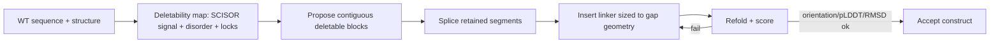

# Structural integrity: block deletion + linker repair (WS3)

This is the hardest workstream and the one that turns SCISOR from a sequence model into
a minigene designer. Domain locking (WS2) keeps the right residues; this workstream
keeps the **tertiary organization** intact when we remove large internal regions.

## 1. The problem

SCISOR deletes residues to maximize naturalness. At 30% deletion (TSC2/SHANK3) those
deletions are scattered, which:
- nibbles the edges of structured domains,
- removes residues from the middle of secondary structure, and
- leaves retained domains connected by whatever happens to survive — with no control
  over the geometry of the junction.

The rational approach (MT9 and the SHANK3/SYNGAP1 minigenes) does the opposite: delete
a **contiguous, disordered, dispensable scaffold** and reconnect the retained functional
segments with an **engineered linker** sized to the gap. We want SCISOR to inform *which*
regions are dispensable, but enforce block-contiguity and junction repair structurally.

## 2. Deletability map (M3.1)

Combine signals into a per-residue "safe to delete in bulk" score:
- **SCISOR signal:** per-residue deletion probability / frequency across samples
  (from [evaluation.md](evaluation.md) tolerance maps).
- **Disorder/flexibility:** predicted pLDDT troughs, cryo-EM unresolved regions,
  IUPred/metapredict disorder.
- **Locks:** the WS2 keep-mask is a hard veto.

Collapse to **contiguous candidate blocks** (e.g. runs of high-deletability ≥ a minimum
length), since the goal is to remove scaffolds, not pepper holes. SCISOR ranks/sieves
the candidate blocks; the structural module decides exact boundaries.

Validation: candidate blocks should recover the known dispensable scaffolds
(TSC2 internal disordered middle; SHANK3 proline-rich; SYNGAP1 ~730–1188).

## 3. Junction repair: the two-tier linker rule (M3.2)

When a block is removed, the two flanking retained segments must be reconnected by a
linker chosen to span the physical gap the deletion creates.

- **Flexible default — (GGGGS)n.** Glycine gives backbone freedom, serine keeps it
  soluble; intrinsically disordered, no secondary-structure propensity, non-immunogenic,
  well-precedented in AAV transgenes. Use where domains just need tethering.
- **Rigid — (EAAAK)n.** A helical spacer that holds two domains in a fixed relative
  orientation. Use at **orientation-sensitive junctions**, where a floppy linker would
  let the geometry wander (the TSC2 HEAT↔GAP failure: GAP confidence collapsed 82→51 with
  a floppy linker; SYNGAP1 GAP↔coiled-coil, since trimer assembly is orientation-sensitive).

**Length tuning, not one-size-fits-all.** A fully extended Gly-Ser chain runs ~3.5 Å per
residue; (GGGGS)×3 = 15 aa reaches ~5.4 nm, which bridges the ~2–3 nm gaps left by MT9's
internal deletions. The rule: size the repeat count `n` to the junction geometry —
measure the end-to-end distance between the C-terminus of the upstream retained segment
and the N-terminus of the downstream one in the folded structure, then choose the
smallest `n` whose extended length comfortably spans it (with margin). Bigger gap → more
repeats; tight gap → fewer.

Junction classification (flexible vs rigid) comes from whether the two joined domains
have a functionally required relative orientation — annotated per junction in the
target's design spec (shares the frozen-set schema from WS2).

## 4. Refold validation loop (M3.3)

The refold loop reuses the heavy quality tier from [benchmarking.md](benchmarking.md):
folds go to the existing `~/phi-api` `esmfold2` (screening) and `boltz2`
(interfaces/co-folds) H100 runners. The WS-P speedup ([performance.md](performance.md))
keeps the linker-search iteration affordable.

For each candidate construct:
1. Fold (ESMFold for screening; Boltz for interfaces/co-folds on shortlist).
2. Check **retained-domain integrity** (domain pLDDT, templated RMSD/TM to WT domains).
3. Check **inter-domain orientation** at repaired junctions (relative rotation/translation
   vs the WT arrangement, where a reference exists).
4. Apply the dual-depressor rule: ignore low linker pLDDT and chimeric-junction
   confidence dips per se; judge domains and geometry.
5. If a junction fails, adjust linker length and/or switch flexible↔rigid and re-fold.

Iterate to convergence or budget. Output: ranked minigene constructs with their
block-deletion map, linker choices, and fold scores.

## 5. Relationship to "constrained diffusion"

Framed as constrained generation: SCISOR provides the **naturalness prior** over what to
remove; the structural module imposes **hard structural constraints** (block-contiguity,
domain integrity, junction geometry) that pure sequence sampling cannot express. WS2
locks are the position-level constraints; WS3 adds region- and geometry-level constraints
plus a repair operator (linker insertion). This is a meaningfully larger model of the
problem than stock SCISOR and is expected to be the bulk of the engineering effort.

## 6. Hard sub-problems / risks
- **Gap-distance estimation** depends on a trustworthy fold of the WT and of the spliced
  construct; errors propagate to linker length.
- **Orientation preservation** is the crux; rigid linkers help but their own geometry
  must be modeled, and (EAAAK)n register matters.
- **Boundary selection** at block ends (trim to domain edges without clipping structure).
- **Clash avoidance** when domains are brought closer than in WT.
- **Search cost:** each linker trial is a fold — A100 strongly preferred.

## 7. Milestone / outcome
**Automatically reproduce an MT9-quality TSC2 minigene**: delete the internal disordered
scaffold, reconnect HEAT / GAP-extension / dimerization interfaces / GAP with
length-matched (GGGGS)n and a rigid (EAAAK)n at HEAT↔GAP, and recover domain pLDDT/RMSD
comparable to the hand design — end-to-end from the deletability map, with no manual
junction tuning. Then generalize to SHANK3 and SYNGAP1.
